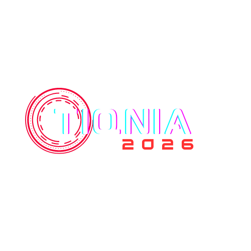

# TIQNIA - IT Fest Website :computer:

# Welcome to the TIQNIA Website Repository! :tada:

### Originally Created by [Rishwal](https://github.com/rishwal).

### Fully Revamped, Updated, and Maintained by [Nihal T](http://www.nihalt.in) :rocket:

Built with **React, Vite, Firebase, and Modern CSS**.

## Table of Contents :scroll:

-   [Introduction](#introduction)
-   [Key Features](#key-features)
-   [Event Details](#event-details)
-   [About Us](#about-us)
-   [Department of Computer Applications](#department-of-computer-applications)
-   [Our Partners](#our-partners)
-   [Registration](#registration)
-   [Contact Us](#contact-us)
-   [Contributing](#contributing)

## Introduction :wave:

Welcome to the repository for the official website of TIQNIA - the IT Fest organized by WMO IG Arts and Science College, Wayanad!

## Key Features :star:

-   **Modern Tech Stack**: Built with React, Vite, and Firebase for high performance.
-   **Responsive Design**: Fully responsive layout ensuring great experience on all devices.
-   **Event Information**: Comprehensive details about the fest, schedule, and departments.
-   **Dynamic Content**: Powered by Firebase for real-time updates on partners and messages.
-   **Event Registration**: Seamless registration process.
-   **Interactive UI**: Featuring smooth animations with Framer Motion and Swiper.

## Event Details :calendar:

### TIQNIA - IT Fest Schedule :alarm_clock:

-   **Date**: 08th January 2026
-   **Location**: Kappumchal, Wayanad
-   **Venue**: WMO IG Arts & Science College

For more details, check out the [official event page](https://github.com/MrNihalT/tiqnia-websitet) :link:

## About Us :information_source:

The IT Fest of WMO IG Arts and Science College, Kappumchal Panamaram, is an exciting event showcasing talents in the field of Information Technology. Conducted by the Department of Computer Applications, this fest features various events testing students' technical skills and creativity.

## Department of Computer Applications :desktop_computer:

The Department of Computer Applications at WMO IG Arts and Science College is dedicated to providing comprehensive education in computer applications and information technology. The IT Fest, Tiqnia, is organized entirely by the students of the BCA department.

# Our Sponsors

We are proud to be associated with our partners and sponsors:

-   ## [Vazhikatti](https://www.instagram.com/vazhikatti__86/)

    

-   ## [Lyfizy Group](https://www.instagram.com/lyfizy_group/)

    

-   ## [Le Ocio](https://www.instagram.com/le_ocio_/)

    

-   ## [Kattumadam Marbles](https://instagram.com/kattumadam_marbles?igshid=YmMyMTA2M2Y=)

    

-   ## [Tiqnia](https://www.instagram.com/tiqnia2023/)
    

## Registration :clipboard:

Ready to participate? Register for TIQNIA now! :point_down:

[Register Here](https://docs.google.com/forms/d/e/1FAIpQLSdq6vwMMFyfPaXFA-j_gz50heXiX0pvhf7XU4eJaG7mjvsMjQ/viewform) :link:

## Contact Us :email:

For any inquiries or assistance, feel free to reach out to our team:

-   **Nihal**: [+91-7736697341](tel:+91-7736697341)
-   **Faadi**: [+91-7907962308](tel:+91-7907962308)
-   **Hisham**: [+91-9072058464](tel:+91-9072058464)
-   **Adnan**: [+91-7510998229](tel:+91-7510998229)

-   **Email**: [nihal.chiyoor@gmail.com](mailto:nihal.chiyoor@gmail.com)

## Contributing :handshake:

Contributions are welcome! If you'd like to contribute, follow these steps:

1. Fork this repository.
2. Create a new branch: `git checkout -b feature/new-feature`.
3. Make your changes and commit them: `git commit -m 'Add new feature'`.
4. Push to the branch: `git push origin feature/new-feature`.
5. Open a pull request.

## We are looking forward to seeing you at TIQNIA! :rocket:
